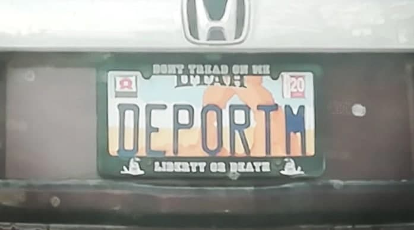

# Desafio IPFacens

O Desafio proposto tem por objetivo realizar a detecção e classificação dos caracteres na placa conforme mostra a imagem abaixo:

## Requerimentos

- Python 3.8
- OpenCV
- Numpy
- imutils

## Métodos e Resultados

Para solucionar este problema, utilizei um conjunto de métodos heuristicos que permitiu realizar cada etapa do projeto de forma a obter a solução desejada. Abaixo detalho a metodologia utilizada em cada etapa:

- <b>Segmentação dos caracteres:</b> Foram utilizados diversos filtros morfológicos e filtos de blur para detectar a placa e depois detectar o retângulo (bbox) de cada caractere. As figuras abaixo mostram os resultados alcançados da detecção da placa e dos caracteres:

- <b>Classificação dos Caracteres:</b> Utilizei os algoritmos de Template Matching implementados na biblioteca OpenCV com diferentes fatores de escala aplicados à imagem da placa para calcular o coeficiente de correlação entre o caractere detectado na imagem e cada caractere disponível na base de dados disponibilizada. Para classificar o caractere detectado na imagem, foram analisados os valores máximos do coeficiente de correlação da imagem com cada dígito presente na base de dados e o caractere foi classificado como aquele que apresentou o maior índice de correlação. O resultado obtido foi:

## Discussão

A taxa de acerto do algoritmo de classificação utilizando o template matching para calculo de correlação entre as imagens foi de 2/7. Isto ocorreu devido ao fato de o coefficiente de correlação não ser uma métrica robusta a variações de escala e forma dos objetos presentes nas images. Para melhorar a taxa de acerto outras métricas podem ser aplicadas, tais como o MSE (Mean Squared Error), a Distância de Hamming e a até mesmo a criação de um classificador Haar Cascade.
